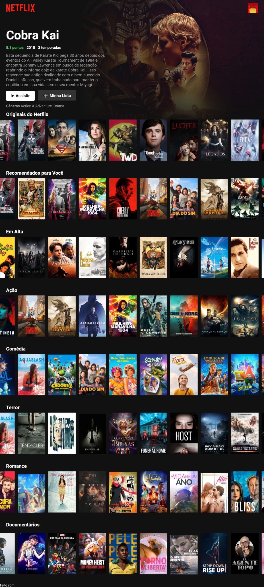

<h1 align='center'>
    
</h1>


<h1>
    
</h1>


## 📝 Sobre: 

Site feito em ReactJS para aprofundar os estudos na tecnologia.

---

## 🚀 Tecnologias utilizadas:

O projeto foi desenvolvido utilizando as seguintes tecnólogias:

- [react-dom](https://reactrouter.com/web/guides/quick-start)
- [material-ui/icons](https://redux.js.org/)

---
## 📦  Como baixar o projeto:

```bash
    
    #Clonar o repositório
    $ git clone https://github.com/chagas42/reactMovie2

    #Entrar no diretório
    $ cd reactMovie2

    #Instalar as dependências 
    $ yarn install 

    #Iniciar o projeto
    $ yarn start
```
Desenvolvido com ❤ por [Junior Chagas](https://github.com/chagas42).